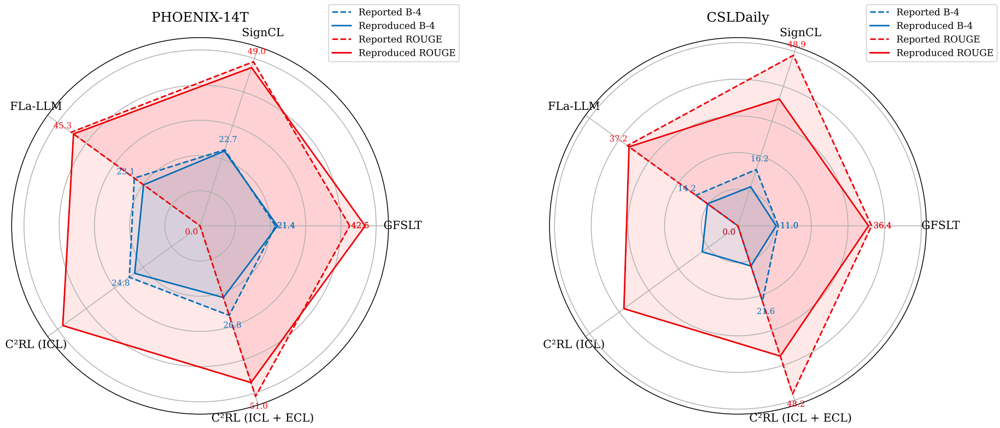

# Gloss-Free Sign Language Translation: An Unbiased Evaluation of Progress in the Field

**Ozge Mercanoglu Sincan, Jian He Low, Sobhan Asasi, Richard Bowden**

**Paper:** [Computer Vision and Image Understanding (CVIU) 2025](https://doi.org/10.1016/j.cviu.2025.104498) | [Preprint (Open Access)](https://openresearch.surrey.ac.uk/esploro/fulltext/journalArticle/Gloss-Free-Sign-Language-Translation-An-Unbiased/991040066602346?repId=12224845200002346&mId=13224845190002346&institution=44SUR_INST)

---

Sign Language Translation aims to convert sign language videos into spoken language text. Reported improvements in the literature can stem from many factors beyond algorithmic novelty, e.g., backbones, preprocessing, training schedules, and evaluation conventions. This repository evaluates five recent gloss-free Sign Language Translation (SLT) methods — **GFSLT-VLP**, **SignCL**, **Sign2GPT**, **Fla-LLM**, and **C2RL** — by reimplementing the key innovations in a unified codebase under consistent conditions.


The following key contributions are implemented:

| Method | Key idea | Paper | Code |
|--------|----------|-----------|-----------|
| **GFSLT-VLP (Zhou et al., 2023)** | Visual-language pretraining | [ICCV'23](https://openaccess.thecvf.com/content/ICCV2023/html/Zhou_Gloss-Free_Sign_Language_Translation_Improving_from_Visual-Language_Pretraining_ICCV_2023_paper.html) | [Github](https://github.com/zhoubenjia/GFSLT-VLP) |
| **SignCL (Ye et al., 2024)** | Contrastive learning on adjacent frames | [NeurIPS'24](https://www.proceedings.com/content/079/079017-3411open.pdf) | [Github](https://github.com/JinhuiYE/SignCL) |
| **Sign2GPT (Wong et al., 2024)*** | Pseudo-gloss pretraining | [ICLR'24](https://iclr.cc/virtual/2024/poster/18847) | [Github](https://github.com/ryanwongsa/Sign2GPT) |
| **Fla-LLM (Chen et al., 2024)** | Lightweight translation (Light-T) in pretraining | [LREC-COLING'24](https://aclanthology.org/2024.lrec-main.620/)  | |
| **C2RL (Chen et al., 2025)** | Combine [CiCO loss](https://github.com/FangyunWei/SLRT/tree/main/CiCo) + Light-T |[IEEE TCSVT'25](https://ieeexplore.ieee.org/document/10933970) |  |

<figure>
  
  <figcaption>Overview and training objectives of compared methods.</figcaption>
</figure>

> *Sign2GPT uses a fundamentally different architecture (DINOv2, XGLM, LoRA adapters) compared to the mBART-based framework used for the other methods. Adapting its pseudo-gloss pretraining strategy into our unified framework yielded significantly lower performance. Implementation is not included in this repository. Please refer to the [official codebase](https://github.com/ryanwongsa/Sign2GPT).

---

## Installation

**Prerequisites:** Python 3.9, a CUDA-enabled GPU, and ~24 GB shared memory for data loading.

### Option A — Conda

```bash
# 1. Create environment
conda create -n sltbaselines python=3.9 -y
conda activate sltbaselines

# 2. Install PyTorch (adjust the CUDA version to match your driver)
conda install pytorch==1.13.0 torchvision==0.14.0 torchaudio==0.13.0 pytorch-cuda=11.7 -c pytorch -c nvidia -y

# 3. Install remaining dependencies
pip install -r assets/requirements.txt
```

### Option B — Docker

```bash
# Build the image (from the repository root)
docker build -t sltbaselines:cuda11.7 -f Code/assets/Dockerfile Code/assets

# Run with GPU access
docker run --gpus all -it --shm-size=24gb \
  -v "$(pwd)"/Code:/Code \
  -v "$(pwd)"/mbart_models:/mbart_models \
  -w /Code \
  sltbaselines:cuda11.7 \
  /bin/bash
```

---

## Data preparation steps
1. Download datasets.

2. Build LMDB databases for fast data loading (optional):

   ```bash
   python scripts/create_lmdb.py \
     --src_dir /path/to/Phoenix-2014T/frames \
     --dst_path /path/to/Phoenix_lmdb
   ```

3. Prepare mBART models. The configs expect a trimmed mBART tokenizer and model under `../mbart_models/`. Refer to [pretrain_models](https://github.com/zhoubenjia/GFSLT-VLP/blob/main/pretrain_models/README.md).

---

## Training

Training follows a two-stage pipeline:
1. **Stage 1 — Vision–Language Pretraining (VLP):** Learn aligned visual and textual representations.
2. **Stage 2 — SLT Fine-tuning:** Fine-tune the encoder–decoder for translation using the Stage 1 checkpoint.

### Stage 1: Vision–Language Pretraining

GFSLT, CICO, and SignCL use `train_vlp.py`, Fla-LLM and C2RL use `train_slt.py` for pretraining.

```bash
# GFSLT
python train_vlp.py --config ./configs/phoenix/config1.yaml --model_type gfslt

# CICO (cross-lingual contrastive learning)
python train_vlp.py --config ./configs/phoenix/config1.yaml --model_type cico

# SignCL
python train_vlp.py --config ./configs/phoenix/config1.yaml --model_type signcl

# Fla-LLM  (lightweight translation: gfslt model without pretraining)
python train_slt.py --config ./configs/phoenix/config1.yaml --model_type gfslt --finetune=""

# C2RL  (CiCO loss + lightweight translation)
python train_slt.py --config ./configs/phoenix/config1.yaml --model_type c2rl --finetune=""
```

### Stage 2: SLT Fine-tuning

Fine-tune from the best Stage 1 checkpoint using `train_slt.py`:

```bash
# GFSLT
python train_slt.py --config ./configs/phoenix/config1.yaml \
  --finetune <CHECKPOINT_PATH> --model_type gfslt

# CICO
python train_slt.py --config ./configs/phoenix/config1.yaml \
  --finetune <CHECKPOINT_PATH> --model_type cico

# SignCL
python train_slt.py --config ./configs/phoenix/config1.yaml \
  --finetune <CHECKPOINT_PATH> --model_type signcl

# Fla-LLM  (frozen visual encoder, 12-layer mBART decoder)
python train_slt.py --config ./configs/phoenix/flallm_config1_stage2.yaml \
  --finetune <CHECKPOINT_PATH> --model_type flallm \
  --frozenFeatureExtractor

# C2RL
python train_slt.py --config ./configs/phoenix/flallm_config1_stage2.yaml \
  --finetune <CHECKPOINT_PATH> --model_type c2rl \
  --frozenFeatureExtractor
```


### Model-specific hyperparameters

| Model | Parameter | 
|-------|-----------|
| SignCL | `--zipf_factor`, `--signcl_warmup_epochs`, `--signcl_decay_rate`   |
| Fla-LLM / C2RL | `--frozenFeatureExtractor`, `--lr_llm_adapter`  |
---

## Evaluation

```bash
python train_slt.py \
  --config ./configs/phoenix/config1.yaml \
  --model_type gfslt \
  --eval \
  --resume <CHECKPOINT_PATH>
```

**Dataset-specific conventions** (following prior work):
- **Phoenix-2014T:** Dot (` .`) is appended to each sentence.
- **CSL-Daily:** Character-level BLEU.

---

## Results

All models are trained on a **single NVIDIA A100 GPU** with batch size 8. All models are trained and evaluated three times with random seeds (0, 42, 100). Our analysis reveals that many reported performance gains diminish under consistent experimental setups, demonstrating that implementation details significantly impact results.

<figure>
  
  <figcaption>Reported vs. reproduced results on Phoenix-2014T and CSL-Daily.</figcaption>
</figure>

---

## Citation

```bibtex
@article{sincan2025gloss,
  title   = {Gloss-free Sign Language Translation: An unbiased evaluation of progress in the field},
  journal = {Computer Vision and Image Understanding},
  volume  = {261},
  pages   = {104498},
  year    = {2025},
  issn    = {1077-3142},
  doi     = {https://doi.org/10.1016/j.cviu.2025.104498},
  author  = {Ozge Mercanoglu Sincan and Jian He Low and Sobhan Asasi and Richard Bowden}
}
```

---

## Acknowledgements

This codebase is built upon [GFSLT-VLP](https://github.com/zhoubenjia/GFSLT-VLP). We thank all authors who 
released their code, which served as useful references for our reimplementations, and the C2RL authors for kindly sharing part of their implementation.

---

## License

This project is released under the MIT License. See [LICENSE](LICENSE) for details.
